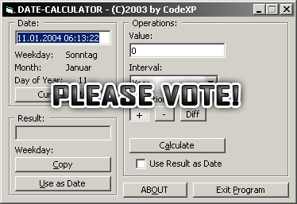



## a DateCalc \- Date/Time Calculator

### Description

Calculating Date and Time (English & German). Just Test it! Plz Vote me! thx!
 
### More Info
 

             |
---                |---
**Submitted On**   |2003-10-22 21:07:32
**By**             |[CodeXP](https://github.com/Planet-Source-Code/PSCIndex/blob/master/ByAuthor/codexp.md)
**Level**          |Advanced
**User Rating**    |4.5 (54 globes from 12 users)
**Compatibility**  |VB 4\.0 \(32\-bit\), VB 5\.0, VB 6\.0
**Category**       |[Math/ Dates](https://github.com/Planet-Source-Code/PSCIndex/blob/master/ByCategory/math-dates__1-37.md)
**World**          |[Visual Basic](https://github.com/Planet-Source-Code/PSCIndex/blob/master/ByWorld/visual-basic.md)
**Archive File**   |[a\_DateCalc1692771112004\.zip](https://github.com/Planet-Source-Code/codexp-a-datecalc-date-time-calculator__1-50918/archive/master.zip)

